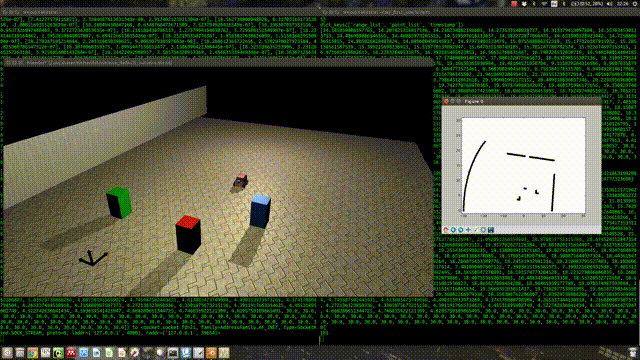
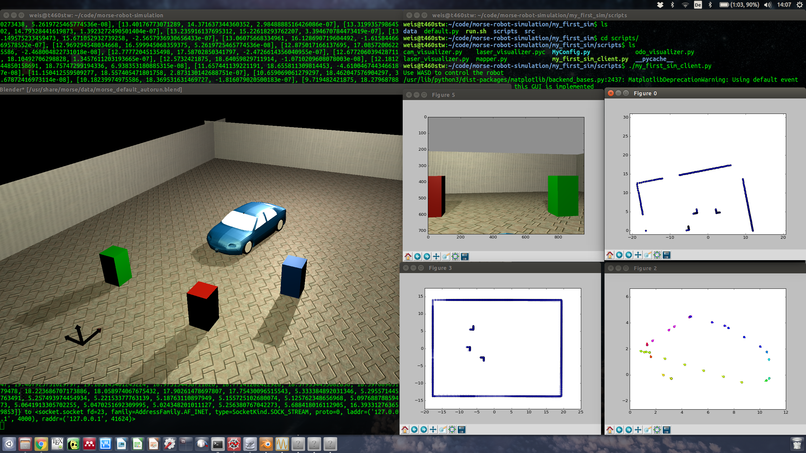

# morse-robot-simulation
This repo contains a MORSE robot simulation project.

To run it with morse:
morse import my_first_sim
morse run my_first_sim

I adapted it to feature a laserscanner as well as client-code to read and visualize measurements:

Please find more detailed informations here: http://blog.tobias-weis.de/simulating-robots-with-morse/
